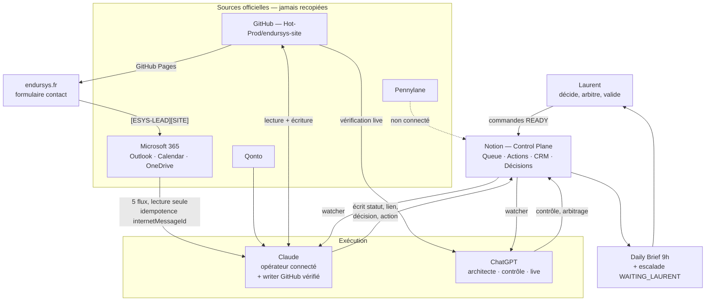

# Roadmap IT EndurSys — Connexion & automatisation

**Version 1.0 — 12/09/2026** · Revue du plan d'action Notion · Statut : **PROPOSÉ**, à valider par Laurent
Sources : `AI Command Queue` (30 lignes), `AI Governance Change Log`, `Master Prompt v1.5`, `Tableau de bord — Pilotage EndurSys`, `Audit digital EndurSys v0.1`, dépôt `Hot-Prod/endursys-site`.

> Ce document est la **vérité de trajectoire**. La Queue reste la **vérité d'exécution**.
> Règle de synchro (Change Log, statut CONSENSUS) : toute commande passée en `DONE` met à jour la ligne de roadmap correspondante.

---

## 1. Ce que dit la revue

État réel de l'`AI Command Queue`, requêté le 12/09/2026 :

| Statut | Nombre |
|---|---|
| DONE | 23 |
| CANCELLED | 2 |
| **WAITING_LAURENT** | **5** |
| READY | 0 |
| IN_PROGRESS | 0 |
| **Total** | **30** |

**Constat central : la file est à l'arrêt complet côté IA.** Zéro commande `READY`, zéro `IN_PROGRESS`. Les 5 commandes ouvertes attendent toutes une action de Laurent. Le watcher Claude et le Daily Brief tournent bien, mais n'ont plus rien à exécuter — le système consomme des cycles sans produire de travail.

C'est une inversion de la baseline du 11/09 (« 74 % des commandes closes sans arbitrage Laurent ») : au 12/09, **100 % des commandes ouvertes dépendent de Laurent**. Le goulot n'est plus la capacité d'exécution, c'est le débit de décision.

Deux écarts de tenue à corriger :

- Le `Tableau de bord — Pilotage EndurSys` affiche encore le snapshot du 11/09 (23 commandes, 17 DONE, 1 WAITING_LAURENT). Périmé.
- Deux commandes portent le même identifiant **P0-034** (« Déployer Daily Brief planifié » et « Réconcilier Master Prompt v1.5 »). La Queue étant le bus canonique des handoffs, un ID en double casse la traçabilité.

---

## 2. Les 5 blocages se ramènent à 3 goulots

### Goulot A — Le lot manuel du lundi 14/09 · 3 commandes en cascade

`P0-032` (migration OneDrive) → `P0-029` (archive puis suppression `/Site`) → `P0-030` (flux mails M365 → Notion).

Une seule session physique de Laurent débloque les trois. **C'est le chemin critique de tout le système IT** : tant que `P0-029` n'a pas rendu son GO, la connexion large M365 reste interdite par contrainte explicite.

Vérifié dans le dépôt ce jour : `/Site` est toujours présent, **19 fichiers / 240 591 octets** — strictement conforme au manifeste de contrôle attendu par `P0-029`. Le manifeste détaillé (chemin + taille par fichier) est produit et versionné : `.ops/manifeste-site-archive-2026-09-11.txt`. Lundi, le contrôle devient une comparaison ligne à ligne au lieu d'un recomptage.

> **Contrainte de séquencement à respecter absolument** : ne modifier **aucun** fichier de `/Site` avant que l'archive OneDrive soit vérifiée. Toute édition invaliderait le contrôle 19 fichiers / 240 591 octets. Les corrections de contenu (Goulot B) ne portent que sur la racine.

### Goulot B — Le droit d'écriture GitHub · 2 commandes · **levable aujourd'hui**

`P1-021` (références de contact du site) et `P1-024` (GA4 + Search Console) sont bloquées sur le même point unique : l'installation GitHub ChatGPT/Codex reçoit un **403 en écriture Contents**.

**Ce goulot ne nécessite plus d'action de Laurent sur GitHub.** Vérifié le 12/09 : la session **Claude Code dispose d'un accès en écriture confirmé** sur `Hot-Prod/endursys-site` (push testé sur la branche `claude/endursys-it-roadmap-851yuq`).

Cela tranche un arbitrage resté ouvert au `AI Governance Change Log` — proposition « Acter ChatGPT comme seul exécutant GitHub », statut `PROPOSED`, réponse en **DÉSACCORD PARTIEL** : *« le principe d'un seul writer GitHub est bon, mais ne pas figer ChatGPT comme writer tant que l'écriture réelle reste refusée 403 ; désigner dynamiquement l'agent disposant d'un accès write vérifié »*.

→ **L'agent disposant d'un accès write vérifié au 12/09 est Claude Code.** La règle proposée est donc applicable en l'état, sans attendre le déblocage de Codex.

Périmètre exact restant à corriger, mesuré dans le dépôt :

| Constat | Mesure |
|---|---|
| Fichiers racine contenant `endursys@outlook.com` | **12** (2 occurrences chacun : `mailto:` + JSON-LD ou action de formulaire) |
| Occurrences de `laurent@endursys.fr` dans le dépôt | **0** |
| Cible du formulaire de contact | `https://formsubmit.co/endursys@outlook.com` |
| Balise GA4 / analytics en racine | **absente** |

Fichiers concernés : `404.html`, `a-propos.html`, `cas.html`, `confidentialite.html`, `contact.html`, `expertises.html`, `index.html`, `mentions-legales.html`, `merci.html`, `methode.html`, `missions.html`, `deploy-checklist.txt`.

### Goulot C — L'absence de volume réel · 1 commande · non forçable

`P0-030` : les flux 1 à 4 ne peuvent pas être validés en positif — la boîte `laurent@endursys.fr` ne contient qu'un mail système. Le filtrage négatif, lui, fonctionne (flux 5 : aucune écriture Notion à tort).

Ce n'est pas un blocage à résoudre, c'est une condition à attendre. La bonne réponse est de rendre la reprise **auto-déclenchée** plutôt que re-scannée — c'est exactement la proposition Claude en attente au Change Log (« suspendre le re-check horaire de P0-030 tant que P0-029 reste bloquant »), déjà en ACCORD côté ChatGPT, sans décision Laurent.

---

## 3. Roadmap

| Phase | Fenêtre | Déclencheur | Condition de sortie |
|---|---|---|---|
| **0 — Déblocage sans Laurent** | 12–13/09 | GO Laurent sur cette roadmap | Queue non vide côté IA ; branche site prête à fusionner |
| **1 — Le lot manuel** | lundi 14/09, soir | Session physique Laurent | Archive OneDrive vérifiée ; OneDrive basculé |
| **2 — Fermeture du gate + activation** | 15–19/09 | `P0-029` = DONE | M365 connecté ; 5 flux actifs ; site à jour en production |
| **3 — Automatisation par exception** | 22/09 – 03/10 | Phase 2 close | Le dirigeant ne voit plus que ≤5 priorités, ≤3 décisions, anomalies |

### Phase 0 — Déblocage sans Laurent · 12–13/09

**Objectif : sortir la file de l'arrêt complet, sans rien publier.**

| # | Action | Owner | Réversibilité |
|---|---|---|---|
| 0.1 | Désigner **Claude Code** comme exécutant GitHub write (accès vérifié), passer la ligne Change Log en `CONSENSUS` | Claude → Laurent valide | Règle, annulable |
| 0.2 | Préparer sur branche la correction des 12 fichiers racine : `endursys@outlook.com` → `laurent@endursys.fr`, y compris JSON-LD et cible du formulaire. **Racine uniquement, `/Site` intact.** | Claude Code | Branche non fusionnée |
| 0.3 | Préparer sur la même branche l'intégration GA4 (Measurement ID déjà enregistré en `P1-024`) avec bandeau de consentement, désactivée par défaut | Claude Code | Branche non fusionnée |
| 0.4 | Corriger l'ID dupliqué `P0-034` et rafraîchir le bloc « Pilotage IA/IT » du Tableau de bord | Claude | Écriture Notion, annulable |
| 0.5 | Suspendre le re-check horaire de `P0-030`, le relier au passage de `P0-029` en DONE | Claude | Paramètre de tâche planifiée |

**Ne pas faire en Phase 0** : aucune fusion vers `main`, aucune publication. Le mode TEST / LOW-COST du Master Prompt interdit la publication externe sans GO explicite — et changer l'adresse de contact publique **est** une publication externe.

### Phase 1 — Le lot manuel · lundi 14/09 au soir

**Objectif : franchir le seul obstacle qui ne peut pas être automatisé.**

| # | Action | Owner |
|---|---|---|
| 1.1 | Migration OneDrive EndurSys + HPI vers `laurent@endursys.fr`, par lots, avec journal d'erreurs (`P0-032`) | Laurent |
| 1.2 | Dépôt du ZIP `/Site` dans `EndurSys/99_ARCHIVES/Site_GitHub_duplique_2026-09-11/` | Laurent |
| 1.3 | Contrôle de l'archive contre `.ops/manifeste-site-archive-2026-09-11.txt` — 19 fichiers, 240 591 octets, comparaison ligne à ligne | Claude ou ChatGPT |
| 1.4 | Comparaison post-migration : dossiers, fichiers, tailles, ouverture d'un échantillon, droits | Claude |

**Condition de sortie** : archive conforme au manifeste, sans écart. Aucune suppression GitHub avant ce point.

### Phase 2 — Fermeture du security gate + activation · 15–19/09

**Objectif : rendre le GO de sécurité effectif et brancher les flux.**

| # | Action | Owner | Dépend de |
|---|---|---|---|
| 2.1 | Supprimer `/Site` du dépôt (commit dédié, message référençant P0-029) | Claude Code | 1.3 conforme |
| 2.2 | Vérifier `https://endursys.fr/` en production et `https://endursys.fr/Site/` → 404 | ChatGPT (accès live) | 2.1 |
| 2.3 | Clôturer `P0-029` : verdict de sécurité tracé, GO ou NO-GO explicite | ChatGPT | 2.2 |
| 2.4 | Fusionner la branche site (0.2 + 0.3) vers `main` **sur GO Laurent** — publication externe | Claude Code | GO Laurent |
| 2.5 | Activer les 5 flux M365 → Notion en lecture/classification seule, clé d'idempotence `internetMessageId` | Claude | 2.3 = GO |
| 2.6 | Search Console : valider le domaine, soumettre `sitemap.xml`, demander l'indexation | Laurent + ChatGPT | 2.4 |
| 2.7 | Formulaire contact → email normalisé `[ESYS-LEAD][SITE]` → CRM, testé de bout en bout | Claude | 2.4 |

**Condition de sortie** : un lead de test parcourt formulaire → email → CRM sans intervention manuelle ; un mail réel produit une ligne `Inbox & Commitments` correcte et une seule.

### Phase 3 — Automatisation par exception à l'échelle · 22/09 – 03/10

**Objectif : le système travaille, le dirigeant arbitre.**

| # | Action | Owner |
|---|---|---|
| 3.1 | Étendre le collecteur par exception (`P0-035`) aux 4 flux séparés une fois le volume réel présent : ADMIN, MAIL, SITE, FINANCE | Claude |
| 3.2 | Brancher le Daily Brief sur les sources désormais connectées (Outlook, OneDrive, GitHub) — aujourd'hui limité à Notion / Qonto / Google | Claude |
| 3.3 | Ajouter au Daily Brief la **section d'escalade** : commandes `WAITING_LAURENT` avec leur ancienneté en jours | Claude |
| 3.4 | Rafraîchir le `CEO KPI Snapshot` sur sources officielles, 10 KPI max, par exceptions | Claude |
| 3.5 | Vider le stock des 6 propositions `PROPOSED` du Change Log sans décision Laurent | Laurent |
| 3.6 | Revue de trajectoire : cette roadmap vs Queue vs Actions prioritaires | ChatGPT |

**Condition de sortie** : le critère §15 du Master Prompt est tenu — Laurent voit ≤5 priorités, ≤3 décisions, les anomalies nouvelles et les livrables à valider, et rien d'autre.

---

## 4. Schéma de connexion cible



Une règle de lecture : **toute flèche qui entre dans Notion transporte un statut, un lien et une prochaine action — jamais une copie du document source.**

---

## 5. Ce qui tourne déjà, ce qui manque

**Déjà en place et opérationnel**

- `EndurSys — Claude Queue Watcher` (`trig_01M9MWDaTirECnvDVhgEebRR`) — lecture autonome de la Queue
- `EndurSys — Daily Brief 9h` (`trig_015ePtWqB7KcUcTxQF1LExCH`) — jours ouvrés, 9h Paris, notification push
- Socle M365 cartographié et accessible des deux côtés (Outlook + OneDrive, `P0-031` T3 PASS)
- `endursys.fr` acheté, DNS/CNAME actifs, site servi par GitHub Pages
- Boucle de handoff Claude ↔ ChatGPT validée de bout en bout (`TEST-002` PASS)

**Ce qui manque — les trois trous réels**

1. **Aucun mécanisme ne réagit à un blocage Laurent.** Le watcher lit la Queue, ne trouve que du `WAITING_LAURENT`, et s'arrête sans rien signaler. Un blocage de 4 jours est aujourd'hui indistinguable d'un blocage de 4 heures. → action 3.3.
2. **Aucun writer GitHub n'était désigné**, alors que l'accès existe. Deux commandes P1 sont restées bloquées sur une permission qui n'était pas la seule voie possible. → action 0.1.
3. **Pennylane n'est connecté à rien.** C'est pourtant une des 7 briques de référence et la source comptable officielle. Hors périmètre de cette roadmap, mais à ne pas oublier au prochain cycle.

---

## 6. Trois règles d'automatisation à ajouter

À soumettre au `AI Governance Change Log` selon le cycle `Proposé → Revue autre IA → Consensus → Adopté`.

**R1 — Writer GitHub désigné dynamiquement.** L'écriture GitHub est portée par un agent unique à la fois : celui dont l'accès write est **vérifié par un test réel**, pas supposé. Au 12/09/2026 : Claude Code. Tout changement d'agent est journalisé au Change Log. *Résout le DÉSACCORD PARTIEL en attente.*

**R2 — Escalade par ancienneté.** Toute commande en `WAITING_LAURENT` depuis plus de 3 jours ouvrés remonte en tête du Daily Brief avec son âge et l'action précise attendue. Une file 100 % bloquée sur une personne est une anomalie à signaler, pas un état stable.

**R3 — Reprise sur événement, pas sur horloge.** Une commande bloquée par une dépendance identifiée (`P0-030` ← `P0-029`) ne se re-scanne pas à intervalle fixe : elle se réveille au changement de statut de sa dépendance. *Reprend la proposition Claude déjà en ACCORD côté ChatGPT.*

---

## 7. Commandes Queue prêtes à activer

**Elles ne sont volontairement pas injectées dans la Queue.** Le watcher Claude est actif et prendrait immédiatement en charge toute ligne `READY` ciblée `CLAUDE` : les créer sans GO déclencherait une exécution autonome, dont une publication sur le site. À créer après validation.

```
P0-036 — Corriger les références de contact publiques du site
TARGET: CLAUDE | TYPE: TASK | P0 | LEAD: CLAUDE
TASK: Remplacer endursys@outlook.com par laurent@endursys.fr dans les 12 fichiers racine
      (mailto, JSON-LD, action formulaire). Racine uniquement, /Site strictement intact.
SOURCE: Hot-Prod/endursys-site ; P1-021 ; .ops/roadmap-it-endursys.md
CONSTRAINTS: branche dédiée ; aucune fusion vers main sans GO Laurent ; ne pas toucher /Site
             avant contrôle de l'archive P0-029 ; TEST/LOW-COST.
OUTPUT: branche poussée + diff résumé + liste des fichiers modifiés.
VERIFY: 0 occurrence de endursys@outlook.com hors /Site ; formulaire pointant vers la bonne
        adresse ; JSON-LD valide ; /Site inchangé (19 fichiers / 240 591 octets).
```

```
P0-037 — Intégrer GA4 + consentement, désactivé par défaut
TARGET: CLAUDE | TYPE: TASK | P1 | LEAD: CLAUDE
TASK: Intégrer le Measurement ID GA4 enregistré en P1-024 avec bandeau de consentement,
      et instrumenter uniquement contact_click, form_submit, case_study_view.
SOURCE: P1-024 ; Audit digital v0.1 (section Site)
CONSTRAINTS: aucun tracking avant consentement ; branche réversible ; pas de fusion sans GO.
OUTPUT: branche poussée + procédure de rollback en 3 lignes.
VERIFY: aucune requête analytics avant consentement ; page de confidentialité cohérente.
```

```
P0-038 — Escalade des commandes bloquées dans le Daily Brief
TARGET: CLAUDE | TYPE: TASK | P1 | LEAD: CLAUDE
TASK: Ajouter au Daily Brief une section listant les commandes WAITING_LAURENT avec leur
      ancienneté en jours ouvrés et l'action précise attendue de Laurent.
SOURCE: AI Command Queue ; règle R2 de la roadmap
CONSTRAINTS: section vide = section absente ; ≤5 lignes ; pas de reporting exhaustif.
OUTPUT: brief mis à jour dès la prochaine exécution planifiée.
VERIFY: une commande bloquée depuis >3 jours ouvrés apparaît bien en tête de brief.
```

---

## 8. Décisions attendues de Laurent

| # | Décision | Effet si oui | Effet si non |
|---|---|---|---|
| **D1** | Acter **Claude Code** comme exécutant GitHub write (règle R1) | Débloque `P1-021` et `P1-024` sans attendre GitHub | Les deux commandes restent bloquées sur le 403 Codex, sans date |
| **D2** | Autoriser la préparation **sur branche** des corrections site (contacts + GA4), sans publication | Tout est prêt à fusionner dès le GO de sécurité | Phase 2 démarre avec 2 jours de travail devant elle |
| **D3** | Confirmer la session manuelle du **lundi 14/09 au soir** (OneDrive + ZIP `/Site`) | Cascade A débloquée, `P0-030` peut redémarrer | Le chemin critique glisse d'une semaine |

D1 et D2 n'engagent aucune dépense, aucune publication et sont réversibles. D3 est une contrainte d'agenda, pas un arbitrage.

---

## Annexes

- `.ops/manifeste-site-archive-2026-09-11.txt` — manifeste de contrôle `/Site` (19 fichiers, 240 591 octets), à opposer au ZIP déposé lundi.

**Note d'exposition** : ce dépôt est publié tel quel par GitHub Pages. Tout fichier ajouté doit être considéré comme public une fois fusionné sur `main`. Ces deux fichiers `.ops/` sont volontairement maintenus hors de `main` ; à vérifier après la prochaine mise en production si leur fusion devenait nécessaire.

---

## Journal d'exécution

### Phase 0 — exécutée le 12/09/2026, sur GO Laurent (D1 + D2)

| # | Statut | Preuve |
|---|---|---|
| 0.1 | **Fait** | Claude Code désigné writer GitHub : accès write vérifié, 2 commits poussés. Tranche le DÉSACCORD PARTIEL du Change Log. |
| 0.2 | **Fait** | `08b8c7e` — 13 fichiers (et non 11 : `assets/schema-endursys.jsonld` manquait au relevé initial). |
| 0.3 | **Fait** | `9291b52` — GA4 sous consentement bloquant + section « Mesure d'audience » dans confidentialite.html. |
| 0.4 | **Fait** | Doublon P0-034 corrigé (→ **P0-039**) ; bloc « Pilotage IA/IT » du Tableau de bord rafraîchi. |
| 0.5 | Repris par P0-036 | La boucle d'amélioration coordonnée existait déjà côté ChatGPT ; Claude s'y est branché plutôt que d'ouvrir une routine concurrente. |

**Validation** : 25 contrôles dans Chromium sur les 11 pages racine, tous PASS. Aucune requête analytics avant consentement ni après refus, y compris après rechargement ; une seule balise gtag par page ; `generate_lead` uniquement sur merci.html ; `form_start` une seule fois par formulaire ; `booking_click` sans doublon avec `assets/site.js` ; formulaire, redirection et champs intacts.

**Revue** : PR ouverte à la demande de Laurent — https://github.com/Hot-Prod/endursys-site/pull/1, 4 commits, **non fusionnée**. P1-027 close en PASS T1–T8.

**Non fait, volontairement** :

- Aucune fusion vers `main`. La fusion est une publication externe et reste une décision de Laurent.
- `/Site` non supprimé malgré l'autorisation générale d'override : le contrôle d'archive de P0-029 porte sur 19 fichiers / 240 591 octets et doit rester opposable lundi soir. Supprimer avant l'archive retirerait la seule référence de comparaison.
- Aucune routine planifiée désactivée : voir A1 ci-dessous, arbitrage nécessaire.

### Constat nouveau — les tâches planifiées

12 routines actives, dont **5 paires de doublons** (lecture de Queue, revue hebdo EndurSys, préparation HPI/Mistral, contrôle mensuel, brief du matin) et une routine « Brief matinal — emails importants » dont la dernière exécution a échoué (ABANDONED) **sans que rien ne le signale**.

Le watcher de Queue tourne toutes les heures, soit 24 passages par jour, sur une file qui était entièrement bloquée sur Laurent. C'est le coût récurrent le plus évitable du système aujourd'hui, et la meilleure illustration du besoin de la règle R2.

Détail et recommandations : commande **P0-036 — Session coordonnée d'amélioration EndurSys**.

### Reste à faire

1. **GO fusion Laurent** → vérification GA4 en temps réel, test de réception FormSubmit sur laurent@endursys.fr, puis Search Console.
2. **Arbitrage A1** sur les 5 paires de routines en doublon.
3. **Lundi soir** : archive `/Site` contrôlée contre le manifeste, puis suppression de `/Site`, `style.css` et `script.js` racine dans le même commit.
